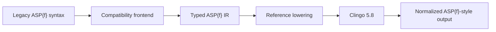

# ASPf-next

[](https://github.com/dylanflynn477/ASPf-next/actions/workflows/ci.yml)
[](https://www.python.org/)
[](LICENSE)
[](docs/roadmap.md)

ASPf-next is an experimental, independent clean-room modernization of Marcello
Balduccini's ASP{f} language for Clingo 5.8. It lets a logic program describe
properties that may have one value or may legitimately be undefined. The
current Python frontend, reference translation, solver wrapper, and model
renderer work end to end for a deliberately bounded historical subset.

This is pre-alpha research software. It does not claim full ASP{f}
compatibility, native-solver performance, or production readiness.

## Why ASP{f}?

Imperative programming tells a computer how to perform a sequence of steps.
Answer Set Programming (ASP) instead describes valid solutions and asks a
solver to find them. ASP{f} additionally models functional properties whose
value can be absent without inventing a sentinel value.

```text
Imperative: tell how
ASP:        describe valid solutions
ASP{f}:     additionally model properties that may legitimately be undefined
```

For example, an account can have a known balance, while another account's
balance is simply not established:

```asp
#nherb balance/1.
balance(account1) #= 500.
solvent(account1) :- balance(account1) #= 500.
```

ASPf-next preserves the crucial distinction:

```text
undefined != 0
undefined != false
undefined != guessed
```

Marcello Balduccini created ASP{f} and the historical Clingo{f}
implementation. ASPf-next revives a useful research language on Clingo's
supported Python API without modifying Clingo, copying the historical
implementation, or silently inventing semantics where the historical boundary
is unclear.

## Try it in under two minutes

Python 3.11 or newer is required. From a checkout:

```console
python -m venv .venv
# macOS/Linux: source .venv/bin/activate
# Windows:     .venv\Scripts\activate
python -m pip install -e ".[dev]"
aspf examples/01_basic_assignment.aspf
```

Expected output:

```text
Answer: 1
solvent(account1) balance(account1)#=500
SATISFIABLE
```

Continue with the [guided examples](examples/README.md), the
[step-by-step quickstart](docs/quickstart.md), or the
[technical-indicator portfolio demo](docs/portfolio-demo.md). The portfolio
example uses synthetic data to demonstrate a partial 14-observation indicator,
defined zero, positive comparison, and default negation; it makes no trading or
predictive claim.

## Current language boundary

The current release supports declarations, assignments, defined-value body
comparisons, a restricted domain-safe variable model, visibility controls, and
ordinary Clingo rules that do not contain unsupported ASP{f} syntax.

| Area | Current status |
| --- | --- |
| Declarations | `#nherb f/n.`, application-style declarations, and global `#nherb.` with a documented zero-arity restriction |
| Assignments | Ground or domain-safe direct-key applications with `#=` in facts and complete rule heads |
| Body comparisons | Positive and singly default-negated `#=`, `#!=`, and integer-only `#<`, `#<=`, `#>`, `#>=` |
| Application operands | Defined-value comparisons between two non-Herbrand applications |
| Values | Integers, symbolic constants, strings, ground undeclared Herbrand terms, and restricted ordinary value variables |
| Variables | Direct application arguments made domain-safe by an ordinary positive atom or a positive scalar seed equality |
| Presentation | Stable text/JSON models and historical `#hide #nherb` / `#show #nherb` controls |
| Explicitly deferred | Arithmetic in n-atoms, aggregates/choices containing n-atoms, nested application operands, and `_v` non-Herbrand variables |

The executable historical corpus has 39 cases: 35 pass and 4 are strict
expected-unsupported cases. Within the 35 passing cases, 7 carry a documented
restriction and 2 reproduce historical rejection of invalid inputs; all 4
unsupported cases are intentionally deferred, and none are unresolved. These
counts are derived from
[`tests/historical_compat/manifest.json`](tests/historical_compat/manifest.json),
not a claim about the whole historical language.

See the normative [supported-language specification](docs/supported-language.md)
and the [compatibility matrix](docs/compatibility-matrix.md) before relying on a
construct. Unsupported or ambiguous ASP{f}-shaped syntax raises a filename-,
line-, and column-aware `UnsupportedSyntaxError`.

## How it works



The frontend uses a context-aware scanner that respects comments, strings,
nested delimiters, multiline statements, and source positions. It validates
the supported notation and records typed IR rather than applying global text
substitutions. The reference backend lowers, for example:

```asp
balance(account1) #= 500.
```

to ordinary Clingo input equivalent to:

```asp
__aspf_value(balance(account1),500).
```

A functionality constraint prevents two different values for one ground key.
There is deliberately no totality rule: absence of a value atom means the
application is undefined. The renderer reconstructs
`balance(account1)#=500` and hides private `__aspf_` predicates.

Positive `#!=` and ordered comparisons require a defined application value;
undefined is not treated as unequal. Default negation tests whether the entire
positive comparison is unsatisfied, which can include undefined operands. It
is not an `is undefined` operator. Ordered comparisons accept only defined
integer values and never coerce strings or symbols.

This is a correctness-oriented reference translation, not a native theory-atom
backend and not a claim to the grounding-efficiency behavior of historical
Clingo{f}. The [architecture document](docs/architecture.md) explains the
component boundaries.

A separate theory-atom/Python-propagator feasibility study reached **PARTIAL GO for
further research and NO-GO for production integration**. It demonstrated constant
copy-rule grounding overhead and matching tested models. Subsequent research hardening
added support-set provenance, conservative provider-complete dynamic-absence reasons,
narrow derived/guard clauses, explicit cache generations, and clause audit records.
Native solving remains substantially slower than the reference and exact historical
n-loop coverage is incomplete. The prototype stays under `research/`; `_v` remains
unsupported by the released frontend and no CLI backend flag was added. See the
[research result](docs/research/native-backend-feasibility.md), the
[adversarial review](docs/research/native-provenance-adversarial-review.md), and the
[benchmark report](docs/benchmarks/native-vs-reference.md).

Useful CLI forms:

```console
aspf --version
aspf examples/01_basic_assignment.aspf --emit-lowered
aspf examples/03_conditional_assignment.aspf --json
aspf examples/05_multiple_models.aspf --models 0
```

## Important restrictions

ASPf-next currently rejects:

- arithmetic expressions inside n-atoms;
- aggregates, choices, disjunctions, or conditional literals containing
  n-atoms;
- `_v` non-Herbrand variables;
- variables nested inside application arguments, anonymous variables, and
  variables without an accepted domain-safe source;
- assignment-head value variables and value variables in ordered comparisons;
- application-to-application comparisons in rule heads;
- declared non-Herbrand applications nested inside another n-atom operand;
- non-integer operands for ordered comparisons;
- double default negation or n-atoms that are not complete supported literals;
- user-written executable identifiers beginning with reserved `__aspf_`.

Ordinary ASP remains ordinary ASP. A declared spelling used outside a `#`
connective keeps its Herbrand interpretation; only a successfully parsed
n-atom key receives non-Herbrand meaning.

## Historical Clingo{f} compatibility

The [`tests/historical_compat`](tests/historical_compat/) corpus tracks source,
semantic, safety, output, restricted, deferred, and backend-dependent cases.
The [historical audit](docs/compatibility/historical-clingof-audit.md) records
the evidence and outcome for every case, while the
[compatibility policy](docs/compatibility/policy.md) defines terms such as
source-compatible and semantically compatible.

```console
pytest tests/historical_compat
python scripts/compatibility_report.py
```

The passing subset includes explicit and application-style declarations,
name/arity identity, global declarations with a restriction, partiality,
visibility controls, default-negated comparisons, application operands,
ordinary value variables, and seed-equality safety. Arithmetic, aggregate
n-atoms, choice n-atoms, and true non-Herbrand variables remain outside the
implemented boundary. ASPf-next does not claim full historical compatibility.

## ASPf-next is not Flingo

ASPf-next and Potassco's
[`flingo`](https://potassco.org/systems/) are separate projects. Flingo targets
ASP with founded conditional linear constraints; ASPf-next targets a restricted
compatibility frontend for ASP{f}'s historical partial-function notation.
Their languages and implementations are not interchangeable. ASPf-next is not
affiliated with Potassco.

## Documentation

- [Quickstart](docs/quickstart.md)
- [Guided examples](examples/README.md)
- [Portfolio demo](docs/portfolio-demo.md)
- [Supported language](docs/supported-language.md)
- [Compatibility matrix](docs/compatibility-matrix.md)
- [Historical compatibility audit](docs/compatibility/historical-clingof-audit.md)
- [Semantics notes](docs/semantics-notes.md)
- [Specification traceability](docs/specification-traceability.md)
- [Architecture and backend boundary](docs/architecture.md)
- [Architecture decisions](docs/decisions/)
- [0.2.0a1 adversarial semantic review](docs/reviews/0.2.0a1-semantic-review.md)
- [Provenance and clean-room policy](docs/provenance.md)
- [Licensing and historical release terms](docs/licensing.md)
- [Roadmap](docs/roadmap.md)
- [0.2.0a2 draft release notes](docs/releases/0.2.0a2.md)
- [0.2.0a1 release notes](docs/releases/0.2.0a1.md)
- [`#!=` development notes](docs/releases/not-equal-development.md)
- [ordered-comparison development notes](docs/releases/ordered-comparisons-development.md)
- [domain-safe variable development notes](docs/releases/domain-safe-variables-development.md)
- [non-Herbrand variable research](docs/design/non-herbrand-variables.md)
- [native-backend feasibility result](docs/research/native-backend-feasibility.md)
- [native-versus-reference benchmark](docs/benchmarks/native-vs-reference.md)

## Status and development

The current source version is the unpublished `0.2.0a2` release candidate; the
latest published release is `0.2.0a1`. The candidate does not expand the public
supported-language boundary. It adds research-backend correctness hardening,
adversarial and differential coverage, benchmark evidence, a CLI version flag,
package smoke checks, and release documentation. The reference backend remains
the production/default implementation, while the native backend and `_v`
remain research-only and unsupported respectively.

```console
ruff format --check src tests
ruff check src tests
mypy src
pytest
pytest tests/conformance
pytest tests/historical_compat
python scripts/compatibility_report.py
```

Contributions must follow the [clean-room contribution guide](CONTRIBUTING.md).
The original research is described in Marcello Balduccini's paper,
["ASP with non-Herbrand partial functions: a language and system for practical use"](https://doi.org/10.1017/S1471068413000343).
Detailed attribution and implementation provenance are recorded in
[`docs/provenance.md`](docs/provenance.md).

ASPf-next is independently created and maintained by Dylan Flynn. It is not
endorsed by or affiliated with Marcello Balduccini, the historical Clingo{f}
project, or Potassco.

## License

The `0.2.0a2` release candidate is offered under the
[PolyForm Noncommercial License 1.0.0](LICENSE), an established source-available
license that is not OSI-approved. Commercial use requires prior written
permission or a separate commercial license from the copyright holder. See the
[licensing guide](docs/licensing.md) before relying on a use case or contacting
the maintainer.

ASPf-next `0.2.0a1` was released under the MIT License. Rights granted under
that release remain governed by its accompanying MIT License. Beginning with
version `0.2.0a2`, subsequent releases are planned to be distributed under the
PolyForm Noncommercial License 1.0.0, subject to final copyright-holder and
legal review. This change does not revoke or narrow rights already granted for
`0.2.0a1`.

The same non-revocation principle applies to any other repository revision a
recipient validly obtained with an MIT License before the transition. Users
should retain and consult the license accompanying the exact revision they use.

These terms cover this clean-room implementation only; they do not imply
ownership of ASP{f} or the historical Clingo{f} work.
