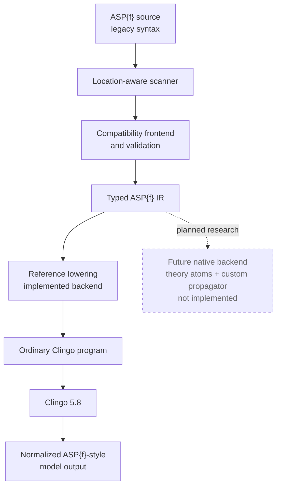

# Architecture

## Current pipeline

The implemented frontend follows this explicit pipeline:



The solid path is implemented. The dashed branch is architecture research only.

Each boundary has a distinct responsibility:

1. **Source scanning** (`source.py`) tracks filenames, one-based line/column
   locations, quoted strings, line and block comments, and nesting depth for
   parentheses, brackets, and braces. It finds top-level statement boundaries
   without rewriting source globally.
2. **Compatibility parsing** (`frontend.py`) collects declarations, recognizes
   supported n-atoms in valid rule positions, validates the restricted term
   grammar and source-variable safety, and rejects ambiguous or deferred syntax.
   Declaration lookup uses exact `(name, arity)` identity. Under a `#`
   connective, that lookup distinguishes application operands from undeclared
   compound Herbrand scalar values. Outside n-atoms, declared symbols keep
   ordinary Herbrand meaning and statements remain source text.
3. **ASP{f} IR** (`ir.py`) records declarations, ordinary statements, structured
   applications, distinct ground and variable arguments, typed scalar and
   application operands, separate assignment and body-comparison nodes, typed
   operators, explicit body-comparison polarity, and absolute source spans. No
   Clingo solver object is part of the IR.
4. **Reference lowering** (`lowering.py`) replaces only the validated IR spans
   with private relational atoms and appends the functionality constraint.
   Ordered comparisons also use `__aspf_integer/1` to distinguish integer
   assignment values from strings and symbols. Default-negated comparisons
   define positive satisfaction with fresh parameterized `__aspf_sat_*`
   predicates and default-negate those predicates. It never adds totality.
5. **Solving** (`solver.py`) uses the public Clingo 5.8 Python `Control` API to
   add, ground, and solve the lowered program. `--models 0` maps to unbounded
   model enumeration.
6. **Model normalization** (`model.py`) reads ordinary shown symbols separately
   from all true atoms. It filters the private `__aspf_` namespace and
   reconstructs value atoms in stable ASP{f} notation.
7. **CLI orchestration** (`cli.py`) reads one or more UTF-8 files, selects lowered,
   JSON, or human output, and turns expected frontend/solver failures into clear
   diagnostics.

## Why source spans, not global substitutions

`#=` can appear inside comments or quoted strings, and a rule can span lines or
contain nested aggregates and terms. A global regular-expression replacement
cannot reliably distinguish those contexts. The scanner therefore exposes
executable characters and their nesting state. The frontend produces exact
replacement spans only after a complete n-atom is validated. Lowering applies
those non-overlapping spans from right to left.

Regular expressions are used only for small, already-isolated lexical forms
such as a declaration or atomic term; they are not the parsing architecture.

## Multiple files

All files are scanned separately so diagnostics retain their true filename,
line, and column. Declarations are collected across every file before statements
are validated, allowing a declaration in one file to serve rules in another.
The combined IR is then lowered into one Clingo base program.

## Historical compatibility layer

The source-backed compatibility target is executable but does not alter the
pipeline. `tests/historical_compat/manifest.json` records passing, strict-xfail,
and unresolved historical cases independently of the project-boundary
conformance corpus. `scripts/compatibility_report.py` renders only that manifest
data.

Global `#nherb.` is represented by `Program.global_nherb`, not synthesized
declaration text. Before statement parsing, the frontend collects left/key
application signatures across all files so a bare right token can be resolved
as a zero-arity application when its signature is established. Positive-arity
functional operands under `#` are applications in global mode; ordinary
occurrences outside n-atoms still pass through unchanged.

Deferred historical constructs keep their architectural boundaries explicit:

- legacy `#show/#hide #nherb` needs typed output-policy IR carried into model
  normalization;
- equality-provided safety needs a grounding-domain design.

None is approximated by text insertion or by weakening an unrelated validator.

## Reference-backend invariant

For each ground key `K`, at most one value may be true:

```asp
:- __aspf_value(K,V1), __aspf_value(K,V2), V1 != V2.
```

The backend intentionally does not derive any `__aspf_value/2` atom merely from
a declaration. Undefinedness is represented by absence. This small encoding is
easy to inspect with `--emit-lowered`, making it useful as an executable semantic
reference for future backends.

For an ordered comparison, the backend requires both a value lookup and a
private integer marker before applying the ordinary relation:

```asp
__aspf_value(K,V), __aspf_integer(V), V < 0
```

The marker is emitted only for integer literals that can be assigned by a
validated `#=` rule. This prevents Clingo's ordering over arbitrary ground terms
from becoming accidental numeric coercion. Private `#defined` directives keep
Clingo from reporting intentionally absent private atoms as undefined ordinary
predicates; they derive no atoms and do not make functions total.

When a direct key argument is a source variable, the frontend first requires an
independent occurrence in an ordinary, unnegated positive symbolic body atom.
Lowering then preserves the variable in the relational key. Clingo grounds the
ordinary domain atom and private lookup together. Generated `__aspf_` atoms and
helper variables are intentionally excluded from source safety analysis, so the
backend cannot manufacture a grounding domain that the input program lacked.

Application equality uses two positive value lookups with one shared generated
value variable. Inequality uses two lookups and an explicit `!=` relation.
Ordering uses two lookups, integer markers for both values, and the arithmetic
relation. A small statement-local allocator chooses deterministic generated
variables while skipping every identifier in that source statement. Because
all comparison paths require positive lookups, an undefined operand makes every
positive application comparison false.

For a default-negated comparison, lowering reuses that exact positive body as
the definition of a fresh helper:

```asp
__aspf_sat_0(A) :-
    __aspf_value(balance(A),V),
    __aspf_integer(V),
    V >= 1000.
flag(A) :- account(A), not __aspf_sat_0(A).
```

Each helper has a deterministic program-local identity. Its arguments are the
unique source variables from both operands in first-occurrence order, so
groundings cannot be merged. Source safety is validated before the helper is
created; generated lookups never legitimize an unsafe input rule. The helper is
a fresh one-way definition of positive satisfaction, so `not __aspf_sat_0`
passes the Clingo reduct exactly when the supported historical `not L` passes
its satisfaction test. Assignment dependencies through ordinary rules retain
their original default-negation cycles. Private helpers are filtered from
human and JSON models but intentionally remain visible in `--emit-lowered`.

## Future native backend (not implemented)

A later, separately reviewed backend may translate validated ASP{f} IR to Clingo
theory atoms and register a custom Python propagator. Clingo 5.8 exposes both
[theory-atom inspection](https://potassco.org/clingo/python-api/5.8/clingo/theory_atoms.html)
and a
[propagator API](https://potassco.org/clingo/python-api/5.8/clingo/propagator.html).

That backend would need an explicit semantic design for:

- theory syntax and mapping from grounded applications to solver literals;
- functionality and undefinedness during propagation;
- thread-local propagator state and undo behavior;
- explanation clauses and conflict handling;
- model reconstruction shared with the reference backend;
- equivalence tests against the reference backend; and
- performance measurements that separate grounding size from solving cost.

No theory definition, propagator, native arithmetic, or optimization work
belongs to the current historical compatibility increment. The frontend and IR are separated
so a native backend can be added without changing the legacy-syntax scanner or
silently changing the reference semantics.
