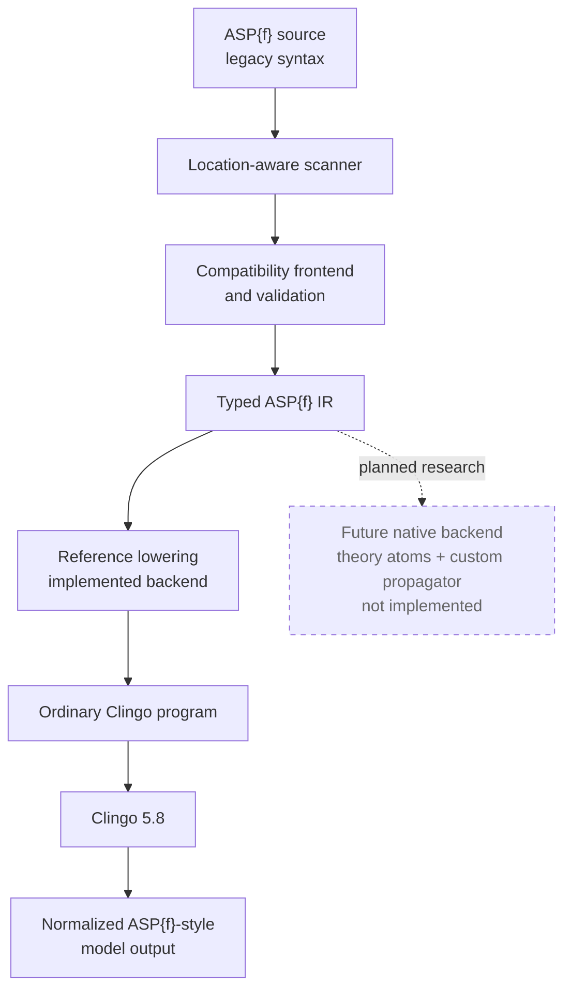

# Architecture

## Current pipeline

The first milestone follows this explicit pipeline:



The solid path is implemented. The dashed branch is architecture research only.

Each boundary has a distinct responsibility:

1. **Source scanning** (`source.py`) tracks filenames, one-based line/column
   locations, quoted strings, line and block comments, and nesting depth for
   parentheses, brackets, and braces. It finds top-level statement boundaries
   without rewriting source globally.
2. **Compatibility parsing** (`frontend.py`) collects declarations, recognizes
   supported n-atoms in valid rule positions, validates the restricted ground
   term grammar, and rejects ambiguous or deferred syntax. Ordinary statements
   remain source text.
3. **ASP{f} IR** (`ir.py`) records declarations, ordinary statements, structured
   applications, values, head/body roles, and absolute source spans. No Clingo
   solver object is part of the IR.
4. **Reference lowering** (`lowering.py`) replaces only the validated IR spans
   with `__aspf_value/2` atoms and appends the functionality constraint. It never
   adds totality.
5. **Solving** (`solver.py`) uses the public Clingo 5.8 Python `Control` API to
   add, ground, and solve the lowered program. `--models 0` maps to unbounded
   model enumeration.
6. **Model normalization** (`model.py`) reads ordinary shown symbols separately
   from all true atoms. It filters the private `__aspf_` namespace and
   reconstructs value atoms in stable ASP{f} notation.
7. **CLI orchestration** (`cli.py`) reads one or more UTF-8 files, selects lowered,
   JSON, or human output, and turns expected frontend/solver failures into clear
   diagnostics.

## Why source spans, not global substitutions

`#=` can appear inside comments or quoted strings, and a rule can span lines or
contain nested aggregates and terms. A global regular-expression replacement
cannot reliably distinguish those contexts. The scanner therefore exposes
executable characters and their nesting state. The frontend produces exact
replacement spans only after a complete n-atom is validated. Lowering applies
those non-overlapping spans from right to left.

Regular expressions are used only for small, already-isolated lexical forms
such as a declaration or atomic term; they are not the parsing architecture.

## Multiple files

All files are scanned separately so diagnostics retain their true filename,
line, and column. Declarations are collected across every file before statements
are validated, allowing a declaration in one file to serve rules in another.
The combined IR is then lowered into one Clingo base program.

## Reference-backend invariant

For each ground key `K`, at most one value may be true:

```asp
:- __aspf_value(K,V1), __aspf_value(K,V2), V1 != V2.
```

The backend intentionally does not derive any `__aspf_value/2` atom merely from
a declaration. Undefinedness is represented by absence. This small encoding is
easy to inspect with `--emit-lowered`, making it useful as an executable semantic
reference for future backends.

## Future native backend (not implemented)

A later, separately reviewed backend may translate validated ASP{f} IR to Clingo
theory atoms and register a custom Python propagator. Clingo 5.8 exposes both
[theory-atom inspection](https://potassco.org/clingo/python-api/5.8/clingo/theory_atoms.html)
and a
[propagator API](https://potassco.org/clingo/python-api/5.8/clingo/propagator.html).

That backend would need an explicit semantic design for:

- theory syntax and mapping from grounded applications to solver literals;
- functionality and undefinedness during propagation;
- thread-local propagator state and undo behavior;
- explanation clauses and conflict handling;
- model reconstruction shared with the reference backend;
- equivalence tests against the reference backend; and
- performance measurements that separate grounding size from solving cost.

No theory definition, propagator, native arithmetic, or optimization work belongs
to the first milestone. The frontend and IR are separated so a native backend can
be added without changing the legacy-syntax scanner or silently changing the
reference semantics.
